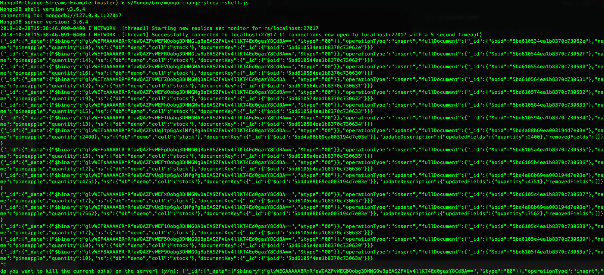

# Mongo Changestream Websocket Demo
An example demonstrating how we can use mongo change streams for realtime data sync between frontend and db.

1. Firstly, set up mongodb locally.

2. Then start it with a replica set:

`./mongod --dbpath ./data/db --replSet "rs"`

3. Now, ___in another shell___, 

start up a mongo shell process and initiate the replica set:

`./mongo
rs.initiate()
`

4. Next, ___in another new shell___, start the changestream websocket server:

`~/Mongo/bin/mongo change-stream-shell.js`

Once you have the change stream listener running then you can insert and update things while watching the json being printed out by the changestream process.

5. So, ___in yet another new shell___, start product inserter:

`~/Mongo/bin/mongo create-products.js`

6. And now, ___in one final new shell___, update one of the products:

` ~/Mongo/bin/mongo update-first-product.js`

And then in your changestream console you should see lovely updates allowing you to see how your data is changing in real time! Wowy cowaboozalators!

  

